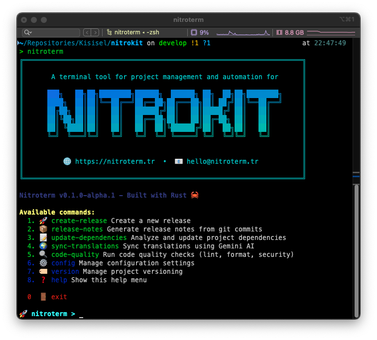

# 🚀 NitroKit Terminal

[](https://opensource.org/licenses/MIT)
[](https://www.rust-lang.org) [](https://github.com/mustafagenc/nitrokit-terminal/actions/workflows/release.yml) <!-- [](https://crates.io/crates/nitrokit)
[](https://crates.io/crates/nitrokit) -->

NitroKit is a powerful terminal application written in Rust that provides comprehensive project management functionalities. It automatically generates detailed release notes from git history and intelligently manages project dependencies across multiple programming languages and package managers.



## ✨ Features

### 📋 Release Notes Generation

- **Smart Git Analysis**: Automatically analyzes git commit history
- **Conventional Commits**: Supports conventional commit format (feat, fix, docs, etc.)
- **Categorized Output**: Groups commits by type (features, fixes, breaking changes)
- **Multiple Tag Formats**: Handles various version tag formats (v1.0.0, 1.0.0, etc.)
- **Contributor Statistics**: Includes detailed contributor information
- **Repository Integration**: Generates links for GitHub, GitLab, and Bitbucket
- **Markdown Export**: Creates beautifully formatted markdown files

### 🔄 Version Management

- **Semantic Versioning**: Automatic version bumping (patch, minor, major)
- **Git Tag Creation**: Creates and pushes version tags
- **Release Creation**: Automated GitHub/GitLab release creation
- **Changelog Generation**: Maintains CHANGELOG.md files

### 📦 Dependency Management

- **Multi-Language Support**: 
  - 📦 **Node.js** (npm, yarn, pnpm)
  - 🦀 **Rust** (Cargo)
  - 🐍 **Python** (pip, requirements.txt)
  - 🐘 **PHP** (Composer)
- **Smart Detection**: Automatically detects project types and package managers
- **Backup & Restore**: Creates backups before making changes
- **Security Auditing**: Runs security checks on dependencies
- **Update Verification**: Ensures updates don't break your project
- **Detailed Reporting**: Provides comprehensive update summaries

### 🌐 Translation Management

- **JSON Translation Sync**: Synchronizes translation files across languages
- **Missing Key Detection**: Identifies missing translation keys
- **Key Validation**: Validates translation file structure
- **Multi-format Support**: JSON, YAML, and more

### 🎯 Interactive Mode

- **User-Friendly Menu**: Easy-to-use interactive interface
- **Command Validation**: Input validation and error handling
- **Progress Indicators**: Visual feedback for long-running operations
- **Colored Output**: Beautiful, colored terminal output

## 🛠️ Installation

### Quick Install

#### Using Cargo (Recommended)

```bash
cargo install nitrokit
```

#### Download Binary

Download the latest binary from [Releases](https://github.com/mustafagenc/nitrokit-terminal/releases):

| Platform | Download |
|----------|----------|
| Windows (x64) | [`nitrokit-windows-x86_64.exe`](https://github.com/mustafagenc/nitrokit-terminal/releases/latest/download/nitrokit-windows-x86_64.exe) |
| macOS (Intel) | [`nitrokit-macos-x86_64`](https://github.com/mustafagenc/nitrokit-terminal/releases/latest/download/nitrokit-macos-x86_64) |
| macOS (Apple Silicon) | [`nitrokit-macos-arm64`](https://github.com/mustafagenc/nitrokit-terminal/releases/latest/download/nitrokit-macos-arm64) |
| Linux (x64) | [`nitrokit-linux-x86_64`](https://github.com/mustafagenc/nitrokit-terminal/releases/latest/download/nitrokit-linux-x86_64) |

#### Install Script (Unix/Linux/macOS)

```bash
curl -sSL https://raw.githubusercontent.com/mustafagenc/nitrokit-terminal/main/install.sh | bash
```

#### Manual Installation

```bash
# Download and install (example for Linux)
wget https://github.com/mustafagenc/nitrokit-terminal/releases/latest/download/nitrokit-linux-x86_64
chmod +x nitrokit-linux-x86_64
sudo mv nitrokit-linux-x86_64 /usr/local/bin/nitrokit
```

### Prerequisites

- **Git** (for release notes generation)
- **Package Managers** (optional, based on your project type):
  - Node.js with npm/yarn/pnpm
  - Python with pip
  - PHP with Composer

## 🚀 Usage

### Command Line Interface

```bash
# Interactive mode (default)
nitrokit

# Generate release notes
nitrokit release-notes

# Create new release with version bump
nitrokit create-release patch    # 1.0.0 -> 1.0.1
nitrokit create-release minor    # 1.0.0 -> 1.1.0
nitrokit create-release major    # 1.0.0 -> 2.0.0

# Update dependencies
nitrokit update-dependencies

# Sync translation files
nitrokit sync-translations

# Show help
nitrokit --help
```

### Interactive Mode

Launch interactive mode for a user-friendly experience:

```bash
nitrokit
```

This will present you with a menu:

```
🚀 NitroKit Terminal Tool v0.1.2
Available commands:
  1. release-notes        Generate release notes from git commits
  2. create-release       Create a new release with version bump
  3. update-dependencies  Analyze and update project dependencies
  4. sync-translations    Synchronize translation files
  5. help                 Show this help menu
  6. exit                 Exit Nitrokit

nitrokit> 
```

### Examples

#### Release Notes Generation

```bash
# Generate release notes for current repository
cd your-project
nitrokit release-notes
```

**Output Example:**
```markdown
# Release Notes v1.2.0

## 🚀 Features
- feat: add user authentication system
- feat: implement dark mode support

## 🐛 Bug Fixes  
- fix: resolve memory leak in parser
- fix: handle edge case in validation

## 📚 Documentation
- docs: update API documentation
- docs: add installation guide

## 👥 Contributors
- Alice Smith (5 commits)
- Bob Johnson (3 commits)
```

#### Create Release

```bash
# Create a patch release (1.0.0 -> 1.0.1)
nitrokit create-release patch

# Create with custom version
nitrokit create-release --version 2.0.0-beta.1
```

#### Dependency Updates

```bash
# Update all dependencies in current project
cd your-project
nitrokit update-dependencies
```

**Sample Output:**
```
[INFO] Scanning for dependency files...
[INFO] Found: package.json, Cargo.toml, requirements.txt

📦 Node.js Dependencies:
[INFO] Using package manager: pnpm
[SUCCESS] Updated 5 dependencies
[INFO] Security audit: No vulnerabilities found

🦀 Rust Dependencies:
[SUCCESS] Updated 3 dependencies
[INFO] All dependencies are up to date

🐍 Python Dependencies:
[WARNING] pip not found, skipping Python updates
```

#### Translation Sync

```bash
# Sync translation files
nitrokit sync-translations

# Output
[INFO] Found base language: en
[INFO] Syncing: fr.json, de.json, es.json
[SUCCESS] Added 5 missing keys to fr.json
[SUCCESS] Added 3 missing keys to de.json
[INFO] es.json is up to date
```

## 🏗️ Project Structure

```
nitrokit-terminal/
├── src/
│   ├── commands/           # Command implementations
│   │   ├── dependency_update.rs
│   │   ├── release_notes.rs
│   │   ├── create_release.rs
│   │   ├── sync_translations.rs
│   │   └── mod.rs
│   ├── utils/              # Utility functions
│   │   ├── file_system.rs
│   │   ├── formatting.rs
│   │   ├── git.rs
│   │   ├── logging.rs
│   │   ├── version.rs
│   │   └── mod.rs
│   ├── tests/              # Test modules
│   │   ├── dependency_update_test.rs
│   │   ├── release_notes_test.rs
│   │   └── mod.rs
│   └── main.rs             # Application entry point
├── .github/
│   └── workflows/          # CI/CD workflows
│       ├── release.yml
│       └── test.yml
├── build.rs                # Build script for Windows resources
├── Cargo.toml              # Rust dependencies
├── README.md
└── LICENSE
```

## 🧪 Testing

```bash
# Run all tests
cargo test

# Run tests with output
cargo test -- --nocapture

# Run specific test module
cargo test dependency_update_test

# Run tests with coverage
cargo test --all-features
```

## 🚀 Development

### Building from Source

```bash
# Clone the repository
git clone https://github.com/mustafagenc/nitrokit-terminal.git
cd nitrokit-terminal

# Debug build
cargo build

# Release build (optimized)
cargo build --release

# Run with logging
RUST_LOG=debug cargo run

# Install locally
cargo install --path .
```

### Code Quality

```bash
# Format code
cargo fmt

# Run clippy for linting
cargo clippy

# Generate documentation
cargo doc --open
```

## 📦 Supported Package Managers

| Language | Package Manager | Status | Features |
|----------|----------------|--------|----------|
| Node.js  | npm           | ✅     | Update, audit, backup |
| Node.js  | yarn          | ✅     | Update, audit, backup |
| Node.js  | pnpm          | ✅     | Update, audit, backup |
| Rust     | Cargo         | ✅     | Update, backup |
| Python   | pip           | ✅     | Update from requirements.txt |
| PHP      | Composer      | ✅     | Update, backup |

## 🔧 Configuration

NitroKit works out of the box without configuration, but you can customize behavior through:

- **Environment Variables**: 
  - `RUST_LOG=debug` for verbose logging
  - `NITROKIT_CONFIG_PATH` for custom config location
- **Git Configuration**: Uses your existing git setup
- **Package Manager Settings**: Respects your existing package manager configurations

## 🤝 Contributing

We welcome contributions! Here's how you can help:

1. **Fork** the repository
2. **Create** a feature branch (`git checkout -b feature/amazing-feature`)
3. **Commit** your changes (`git commit -m 'feat: add amazing feature'`)
4. **Push** to the branch (`git push origin feature/amazing-feature`)
5. **Open** a Pull Request

### Development Guidelines

- Follow [Conventional Commits](https://www.conventionalcommits.org/)
- Add tests for new features
- Update documentation as needed
- Ensure all tests pass: `cargo test`
- Format code: `cargo fmt`
- Run clippy: `cargo clippy`

## 📈 Roadmap

- [x] **Basic CLI Interface** - Interactive terminal interface
- [x] **Release Notes Generation** - Git commit analysis
- [x] **Dependency Management** - Multi-language support
- [x] **Translation Sync** - JSON translation file management
- [ ] **GUI Version** - Desktop application with native UI
- [ ] **More Languages** - Go, Java, C#, Swift support
- [ ] **Cloud Integration** - GitHub/GitLab API integration
- [ ] **Template System** - Customizable release note templates
- [ ] **Plugin System** - Extensible architecture for custom commands
- [ ] **Database Support** - SQLite for project history
- [ ] **Configuration Management** - YAML/TOML config files

## 📊 Stats

- **Languages Supported**: 4 (Node.js, Rust, Python, PHP)
- **Package Managers**: 6 (npm, yarn, pnpm, cargo, pip, composer)
- **Platforms**: Windows, macOS, Linux
- **License**: MIT
- **Minimum Rust Version**: 1.70

## 🐛 Issue Reporting

Found a bug? Please [open an issue](https://github.com/mustafagenc/nitrokit-terminal/issues) with:

- **Environment**: OS, Rust version, package manager versions
- **Expected Behavior**: What should happen
- **Actual Behavior**: What actually happened
- **Steps to Reproduce**: How to reproduce the issue
- **Additional Context**: Screenshots, logs, config files

## 💬 Community

- **GitHub Discussions**: [Ask questions and share ideas](https://github.com/mustafagenc/nitrokit-terminal/discussions)
- **Issue Tracker**: [Report bugs and request features](https://github.com/mustafagenc/nitrokit-terminal/issues)
- **Email**: eposta@mustafagenc.info

## 📄 License

This project is licensed under the MIT License - see the [LICENSE](LICENSE) file for details.

## 🙏 Acknowledgments

- [Clap](https://crates.io/crates/clap) - Command line argument parsing
- [Git2](https://crates.io/crates/git2) - Git repository interaction
- [Colored](https://crates.io/crates/colored) - Terminal color support
- [Serde](https://crates.io/crates/serde) - Serialization framework
- [Tokio](https://crates.io/crates/tokio) - Async runtime
- [SQLx](https://crates.io/crates/sqlx) - Async SQL toolkit
- [Reqwest](https://crates.io/crates/reqwest) - HTTP client

---

⭐ **Star this repository if you find it helpful!**

Made with ❤️ by [Mustafa Genc](https://github.com/mustafagenc)